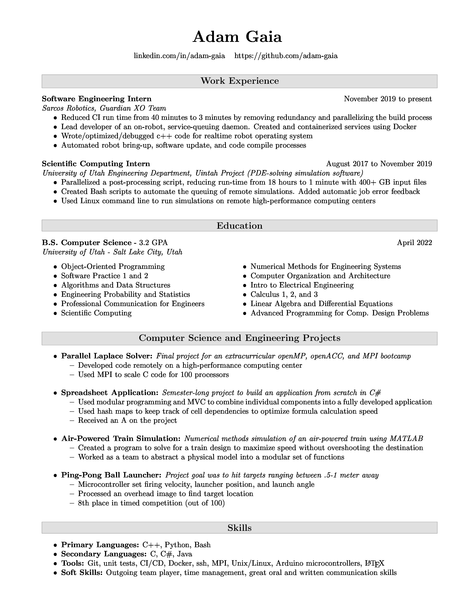

## Build instructions
```
brew cask install basictex # 'pdflatex' tool to render PDFs from LaTeX
brew install imagemagick # Convert from pdf to jpg for this README
git clone https://github.com/adam-gaia/Resume.git
make
open resume.pdf
```

## Preview

