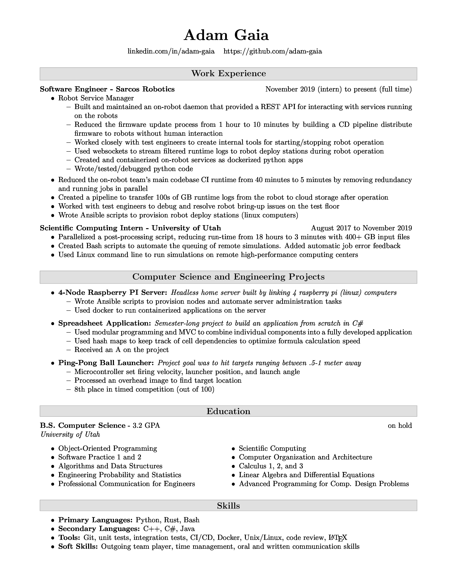

## Build instructions
```
brew cask install basictex # 'pdflatex' tool to render PDFs from LaTeX
brew install imagemagick # Convert from pdf to jpg for this README
tlmgr install xcolor xparse multicol enumitem # Install LaTeX packages
git clone https://github.com/adam-gaia/Resume.git
make
open adamgaia_githubVersion.pdf
```

## Makefile notes
The Makefile builds two copies of my resume:
* The version with my phone number + email that I submit to job apps. Ignored by git.
* The version on this repo without my contact info. The preview of this version is at the bottom of this readme.

When forking this repo for your own resume, please create a file called './contactInfo_private.txt' and add contact info you may not want publicly available.


## Preview

